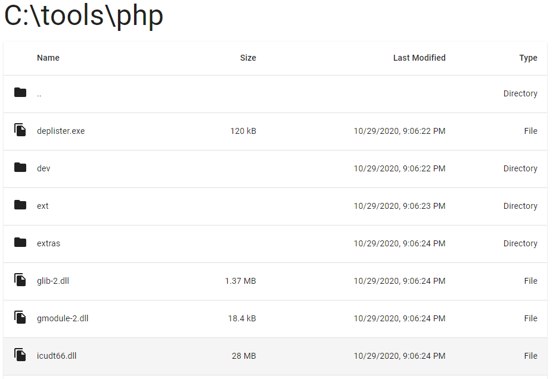

# Browse

Simple file and directory explorer. Run and use it from port 3000.



## Getting Started

## Production

```bash
yarn
yarn build
yarn start
```

Open [http://localhost:3000](http://localhost:3000) with your browser to see the result.

## Production

First, run the development server:

```bash
yarn
yarn dev
```
